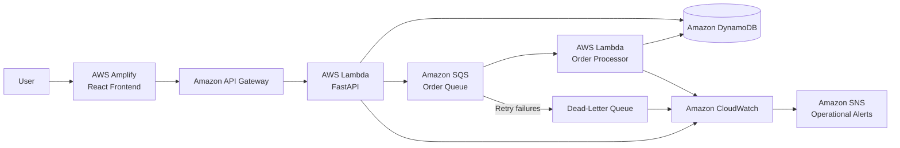

# OrderFlow

**Resilient Serverless Order Processing Platform**

OrderFlow is a cloud-native, event-driven order processing platform built with **React, FastAPI and AWS Serverless services**.

The project demonstrates asynchronous processing, idempotency, failure recovery, infrastructure as code, automated testing, observability and CI/CD through a production-style serverless architecture.

🌐 **Live Demo:**  
https://main.d3ggtltr5kolu8.amplifyapp.com

---

## Architecture



### Request flow

```text
React Frontend
      ↓
API Gateway
      ↓
FastAPI Lambda
      ├────────────→ DynamoDB
      │
      └────────────→ SQS
                        ↓
                   Worker Lambda
                        ↓
                     DynamoDB

Failures → Retry → DLQ → CloudWatch Alarm → SNS
```

---

## Live Application

The React dashboard allows users to create and monitor orders through the deployed AWS backend.

The application supports:

- Order creation
- Prime customer flag
- Delivery type selection
- Automatic priority calculation
- Asynchronous order processing
- Real-time status polling
- Recent order history
- Persistent storage in DynamoDB

Order processing follows the state model:

```text
PENDING
   ↓
PROCESSING
   ↓
COMPLETED
```

Failed processing attempts are retried by Amazon SQS and can eventually be routed to the Dead-Letter Queue.

---

## Key Engineering Features

### Event-driven order processing

The API does not perform the complete order workflow synchronously.

Instead, the API:

```text
1. Creates the order
2. Persists it in DynamoDB
3. Publishes an event to Amazon SQS
4. Returns the order to the client
```

A separate Lambda worker consumes the queue and processes the order asynchronously.

This separates request handling from background processing and improves system resilience.

---

### Idempotent processing

Distributed systems can deliver the same message more than once.

OrderFlow protects order processing using an atomic DynamoDB conditional update.

Before processing an order, the worker attempts to claim it:

```text
PENDING → PROCESSING
```

Only one worker can successfully claim the order.

Duplicate messages therefore do not cause the same completed order to be processed repeatedly.

The implementation also supports stale processing leases so abandoned `PROCESSING` orders can eventually be retried.

---

### Retry and Dead-Letter Queue

Amazon SQS provides automatic retry behavior when the worker fails.

After repeated failures, messages are moved to:

```text
orderflow-orders-dlq-dev
```

This prevents continuously failing messages from blocking normal queue processing and preserves them for investigation.

The failure path has been tested end-to-end:

```text
Invalid event
    ↓
Worker failure
    ↓
SQS retries
    ↓
Dead-Letter Queue
    ↓
CloudWatch alarm
    ↓
SNS notification
```

---

## Order Priority

OrderFlow calculates a priority score from business rules.

```text
Prime customer             +40
Same-day delivery          +30
Next-day delivery          +20
Order total >= $500        +10
Order total >= $1,000      +20
```

Examples:

| Order | Priority |
|---|---:|
| Prime + Same Day | 70 |
| Prime + Same Day + $600 total | 80 |
| Prime + Same Day + $1,200 total | 90 |

The priority score is currently stored as order metadata.

> Amazon SQS Standard queues do not guarantee priority ordering.  
> Therefore, OrderFlow does not claim that higher priority scores are processed before lower priority orders.

A future implementation could use multiple queues or another scheduling strategy if strict priority processing were required.

---

## Observability

OrderFlow emits structured JSON logs to Amazon CloudWatch.

Example events include:

```text
order_processing_started
order_processing_completed
order_processing_failed
```

Logs can include contextual information such as:

```text
order_id
message_id
event_type
error_type
error_message

CloudWatch alarms monitor operational conditions including:

```text
DLQ messages visible
Oldest SQS message age
API Lambda execution errors

Alarm state changes are delivered through an Amazon SNS topic.

## REST API

The FastAPI backend exposes the following endpoints:

| Method | Endpoint | Purpose |
|---|---|---|
| `GET` | `/health` | Service health check |
| `POST` | `/orders` | Create a new order |
| `GET` | `/orders` | Retrieve orders |
| `GET` | `/orders/{order_id}` | Retrieve one order |
| `PATCH` | `/orders/{order_id}/status` | Update order status |

Example order request:

```json
{
  "customer_id": "CUSTOMER-001",
  "items": [
    {
      "product_id": "PRODUCT-001",
      "quantity": 2,
      "unit_price": 300
    }
  ],
  "is_prime": true,
  "delivery_type": "same_day"
}

## Technology Stack

| Area | Technologies |
|---|---|
| Frontend | React, Vite, JavaScript |
| Backend | Python, FastAPI, Mangum |
| Compute | AWS Lambda |
| API | Amazon API Gateway |
| Database | Amazon DynamoDB |
| Messaging | Amazon SQS |
| Failure handling | SQS Dead-Letter Queue |
| Monitoring | Amazon CloudWatch |
| Notifications | Amazon SNS |
| Frontend hosting | AWS Amplify Hosting |
| Infrastructure | AWS SAM, CloudFormation |
| Testing | Pytest, Pytest-Cov |
| Code quality | Ruff |
| CI/CD | GitHub Actions |
| Version control | Git, GitHub |

## Project Structure

```text
order-flow-serverless-platform/
│
├── .github/
│   └── workflows/
│       └── ci.yml
│
├── frontend/
│   ├── src/
│   ├── package.json
│   └── ...
│
├── scripts/
│
├── src/
│   ├── api/
│   ├── domain/
│   ├── handlers/
│   ├── observability/
│   ├── repositories/
│   ├── services/
│   └── workers/
│
├── tests/
│
├── requirements.txt
├── requirements-lambda.txt
├── template.yaml
└── README.md

## Automated Testing

The backend test suite covers domain logic, repositories, services, API behavior and worker processing.

Run locally with:

python -m pytest tests -q --cov=src --cov-report=term-missing

The project currently contains more than 30 automated backend tests.

Frontend validation includes:

npm run lint
npm run build


## Continuous Integration

GitHub Actions automatically validates changes pushed to `main` and feature branches.

The CI pipeline performs:

Backend
├── Install dependencies
├── Ruff code quality checks
├── Pytest
└── Coverage

Frontend
├── npm ci
├── Lint
└── Production build

Infrastructure
├── SAM validation
└── SAM build

Pull requests therefore validate application code and infrastructure before changes are merged.


## Local Development

## Backend tests

Create or use a Python virtual environment and install dependencies:

pip install -r requirements.txt
pip install -r requirements-lambda.txt

Run:

python -m pytest tests -q

## Frontend

cd frontend
npm install
npm run dev

Create:

frontend/.env.local

with:

VITE_API_URL=https://your-api-id.execute-api.us-east-1.amazonaws.com

Then open:

http://localhost:5173

## AWS Deployment

OrderFlow infrastructure is deployed with AWS SAM.

Prepare the Lambda deployment package and validate the template before deployment.

Example:
sam validate --lint --template-file template.yaml
sam build --template-file template.yaml --use-container
sam deploy

The current development architecture uses existing DynamoDB and SQS resources whose identifiers are supplied to the SAM stack as parameters.

The React frontend is deployed independently through AWS Amplify Hosting and communicates with the API through the public API Gateway endpoint.

## Engineering Decisions

OrderFlow intentionally separates HTTP request handling from background processing.

The API Lambda focuses on validation, persistence and event publication, while the worker Lambda performs asynchronous processing.

Repository and queue abstractions keep business logic separated from AWS-specific implementations.

DynamoDB conditional writes provide distributed idempotency without introducing an additional locking service.

SQS retries and a Dead-Letter Queue provide resilient failure handling.

Structured CloudWatch logging and operational alarms improve observability.

Infrastructure is version-controlled through AWS SAM, while GitHub Actions validates code and infrastructure changes automatically.

## Current Limitations

OrderFlow is a portfolio project designed to demonstrate software engineering and cloud architecture concepts.

Current limitations include:

- No authentication or authorization layer
- No payment processing
- No strict priority scheduling
- Development-oriented AWS resource naming
- Public demo intended for demonstration rather than production traffic

A production implementation would additionally require security controls, rate limiting, environment separation, secret management, cost controls and more extensive operational monitoring.

## What This Project Demonstrates

OrderFlow demonstrates practical experience with:

```text
✓ Python and FastAPI
✓ REST API development
✓ React frontend development
✓ Object-oriented and modular design
✓ Event-driven architecture
✓ AWS Lambda
✓ API Gateway
✓ DynamoDB
✓ Amazon SQS
✓ Dead-Letter Queues
✓ Idempotent distributed processing
✓ CloudWatch monitoring
✓ SNS notifications
✓ Infrastructure as Code
✓ Automated testing
✓ GitHub Actions CI
✓ AWS Amplify Hosting
✓ Git and pull-request workflows
```

---

# Author

**Denisse Reyes Galicia**

Computer Engineering graduate interested in Software Engineering, Data Engineering, Cloud and Artificial Intelligence.

GitHub: [Denisse8460](https://github.com/Denisse8460)