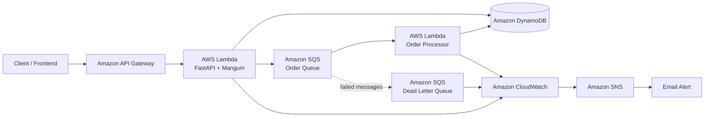

# OrderFlow

> Resilient serverless order processing platform built with Python, FastAPI and AWS.

OrderFlow is a backend and cloud engineering project designed to demonstrate how an order-processing system can handle asynchronous workloads, duplicate deliveries, failures, retries and operational monitoring using a serverless event-driven architecture.

The platform receives orders through a REST API, persists them in Amazon DynamoDB and publishes order events to Amazon SQS. A separate AWS Lambda worker processes those events asynchronously while implementing idempotent order claims, retry handling, dead-letter queues, structured logging and CloudWatch monitoring.

---

## Architecture



---

## Order Processing Flow

```text
POST /orders
     ↓
API Gateway
     ↓
FastAPI Lambda
     ↓
Persist order in DynamoDB
     ↓
PENDING
     ↓
Publish OrderCreated event to SQS
     ↓
Worker Lambda
     ↓
Atomic DynamoDB processing claim
     ↓
PROCESSING
     ↓
COMPLETED
```

Failed messages are automatically retried. Messages that exceed the configured retry policy are moved to a Dead Letter Queue and detected by CloudWatch alarms.

---

## Key Features

- Serverless REST API using FastAPI, Mangum, AWS Lambda and API Gateway
- DynamoDB persistence through a repository abstraction
- Asynchronous event-driven order processing with Amazon SQS
- Idempotent consumers using DynamoDB conditional writes
- Processing leases for interrupted worker executions
- SQS retry strategy and Dead Letter Queue
- Partial batch failure reporting for Lambda/SQS integration
- CloudWatch monitoring and alarms
- Amazon SNS email notifications
- Structured JSON logging with order and message identifiers
- Automated unit and integration-style tests with Pytest
- Code quality validation with Ruff
- Continuous Integration with GitHub Actions
- Infrastructure as Code using AWS SAM
- Environment-based switching between in-memory and AWS infrastructure

---

## Order States

```text
PENDING → PROCESSING → COMPLETED
```

The processing layer also supports safe retries and protects orders against concurrent duplicate processing.

---

## Idempotency

Amazon SQS provides at-least-once delivery semantics, meaning the same message can potentially be delivered more than once.

OrderFlow protects order processing with an atomic DynamoDB conditional update.

Conceptually:

```text
Worker A ──┐
           ├── Try to claim ORDER-001
Worker B ──┘

Worker A → claim succeeds → PROCESSING
Worker B → claim rejected

Worker A → COMPLETED
Worker B retry → detects COMPLETED → safely exits
```

A processing lease also allows an order to be reclaimed if a worker fails unexpectedly while the order is in the `PROCESSING` state.

---

## Resilience

OrderFlow uses an SQS Dead Letter Queue to isolate messages that repeatedly fail processing.

```text
OrderCreated
     ↓
Worker processing
     ↓
Failure
     ↓
Retry
     ↓
Retry
     ↓
Retry
     ↓
Dead Letter Queue
```

CloudWatch monitors the DLQ and triggers an SNS notification whenever failed messages are detected.

Once the issue is resolved and the DLQ returns to a healthy state, an SNS recovery notification can also be generated.

---

## Observability

Worker Lambda executions produce structured JSON logs.

Example:

```json
{
  "event": "order_processing_started",
  "message_id": "MESSAGE-001",
  "order_id": "ORDER-001",
  "event_type": "OrderCreated"
}
```

Successful completion produces:

```json
{
  "event": "order_processing_completed",
  "message_id": "MESSAGE-001",
  "order_id": "ORDER-001",
  "event_type": "OrderCreated"
}
```

Failures include additional information such as the exception type and error message.

CloudWatch alarms currently monitor:

```text
Dead Letter Queue messages
SQS oldest message age
API Lambda errors
```

Notifications are published through Amazon SNS.

---

## REST API

### Health Check

```http
GET /health
```

Example response:

```json
{
  "status": "healthy"
}
```

### Create Order

```http
POST /orders
```

Example request:

```json
{
  "customer_id": "CUSTOMER-001",
  "items": [
    {
      "product_id": "PRODUCT-001",
      "quantity": 1,
      "unit_price": 899
    }
  ],
  "is_prime": true,
  "delivery_type": "same_day"
}
```

Example response:

```json
{
  "order_id": "generated-uuid",
  "customer_id": "CUSTOMER-001",
  "status": "PENDING",
  "total": 899,
  "priority_score": 80
}
```

### Get Order

```http
GET /orders/{order_id}
```

After asynchronous processing:

```json
{
  "order_id": "generated-uuid",
  "status": "COMPLETED"
}
```

### List Orders

```http
GET /orders
```

### Update Order Status

```http
PATCH /orders/{order_id}/status
```

---

## Priority Score

OrderFlow calculates an order priority score based on characteristics such as Prime membership, delivery type and order value.

The score is currently included as event metadata.

Important: the project uses Amazon SQS Standard, which does not provide priority-based message ordering. Therefore, the priority score should not be interpreted as a guarantee that higher-scored orders are processed first.

A future implementation could use multiple queues or another scheduling strategy when strict priority processing is required.

---

## Technology Stack

| Area | Technologies |
|---|---|
| Language | Python 3.13 |
| API | FastAPI, Mangum |
| Cloud | AWS |
| Compute | AWS Lambda |
| API Management | Amazon API Gateway |
| Database | Amazon DynamoDB |
| Messaging | Amazon SQS |
| Monitoring | Amazon CloudWatch |
| Notifications | Amazon SNS |
| Infrastructure as Code | AWS SAM / CloudFormation |
| Testing | Pytest, pytest-cov |
| Code Quality | Ruff |
| CI | GitHub Actions |
| Version Control | Git, GitHub |

---

## Project Structure

```text
order-flow-serverless-platform/
│
├── .github/
│   └── workflows/
│       └── ci.yml
│
├── docs/
│
├── events/
│
├── scripts/
│
├── src/
│   ├── api/
│   ├── domain/
│   ├── handlers/
│   ├── observability/
│   ├── repositories/
│   ├── services/
│   └── workers/
│
├── tests/
│
├── pytest.ini
├── requirements.txt
├── requirements-lambda.txt
├── template.yaml
└── README.md
```

---

## Testing

Run the complete test suite:

```bash
python -m pytest tests -q
```

Current result:

```text
32 passed
```

Run tests with coverage:

```bash
python -m pytest tests -q --cov=src --cov-report=term-missing
```

Run static code checks:

```bash
python -m ruff check src tests scripts
```

---

## Continuous Integration

Every push to `main` or a `feature/**` branch triggers the GitHub Actions CI pipeline.

```text
Push / Pull Request
        ↓
Ruff
        ↓
Pytest + Coverage
        ↓
SAM Validation
        ↓
SAM Build
        ↓
✅
```

The build stage only runs after the code quality and test stage succeeds.

---

## Local Development

Create a virtual environment:

```bash
python -m venv .venv
```

Install dependencies:

```bash
pip install -r requirements.txt
```

Run the API locally:

```bash
uvicorn src.api.app:app --reload
```

The local version can use the in-memory repository and priority queue without requiring AWS resources.

---

## AWS Deployment

The project uses AWS SAM.

Prepare the Lambda package:

```powershell
.\scripts\prepare_lambda_package.ps1
```

Build Lambda-compatible dependencies:

```bash
sam build --use-container
```

Deploy:

```bash
sam deploy
```

The current SAM stack provisions the API Gateway integration, Lambda functions, CloudWatch alarms and SNS notification topic.

The DynamoDB table and SQS queues are existing resources supplied to the stack through deployment parameters.

---

## Engineering Decisions

OrderFlow intentionally separates domain logic from infrastructure through repository and queue abstractions.

This allows the same business logic to operate with:

```text
Local development:
InMemoryOrderRepository
OrderPriorityQueue

AWS:
DynamoDBOrderRepository
SQSOrderQueue
```

The worker is independently deployable from the API and communicates asynchronously through events.

This architecture reduces coupling between request handling and background order processing.

---

## Current Limitations

OrderFlow is a portfolio engineering project rather than a production commerce platform.

Authentication, payment processing, inventory management and customer account management are intentionally outside its scope.

The project currently uses SQS Standard, so the calculated priority score is metadata and does not enforce strict order processing priority.

---

## Planned Presentation Layer

A lightweight React frontend will be added to demonstrate the backend visually.

The interface will focus on:

```text
Create Order
View Order Status
View Recent Orders
```

The frontend is intentionally small because the primary goal of OrderFlow is to demonstrate backend, cloud and distributed-system engineering.

---

## What This Project Demonstrates

OrderFlow demonstrates practical experience with:

```text
Backend development
REST API design
Serverless architecture
Event-driven systems
AWS cloud services
Asynchronous processing
Distributed-system idempotency
Failure handling
Observability
Infrastructure as Code
Automated testing
CI pipelines
Git workflows
```

---

## Author

**Denisse Reyes Galicia**

Computer Engineering graduate interested in Software Engineering, Data Engineering, Cloud and AI/ML technologies.