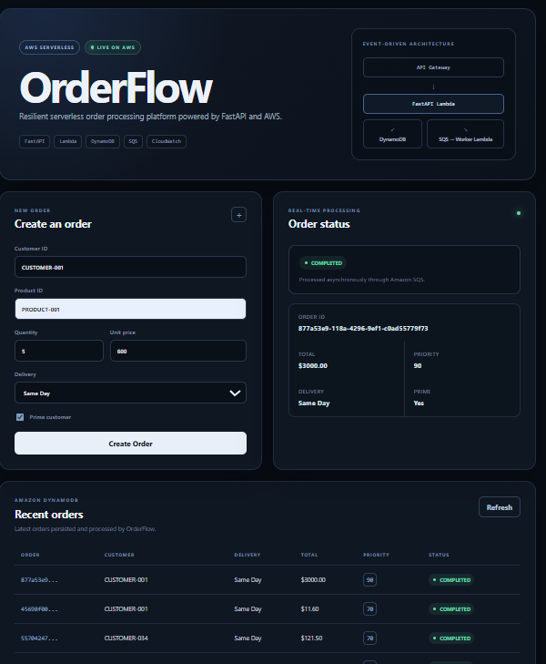
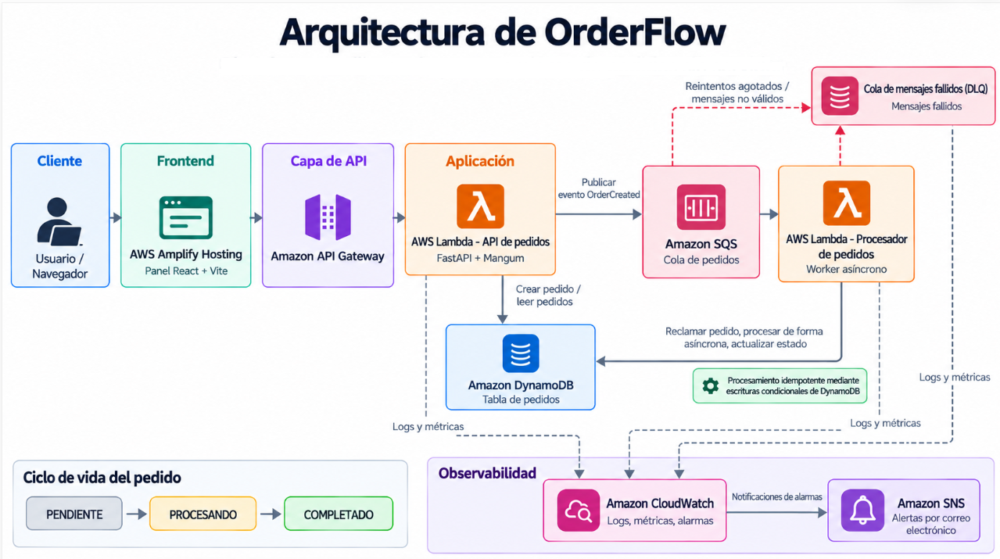
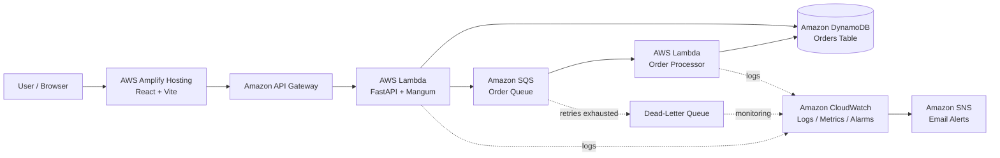
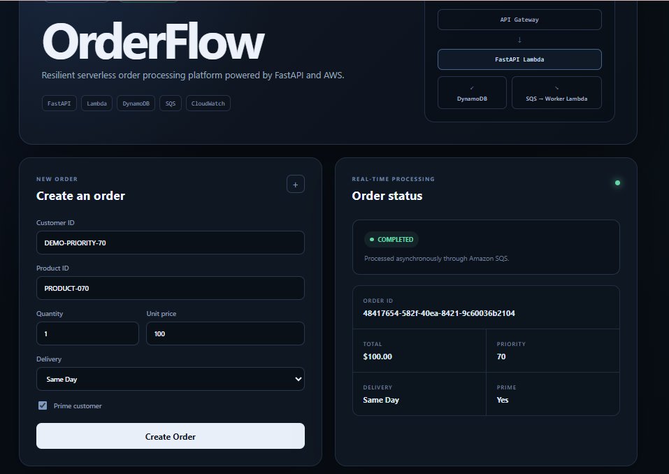
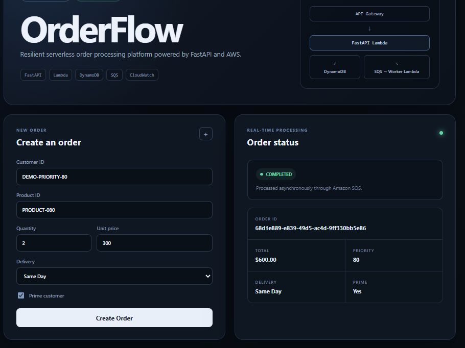
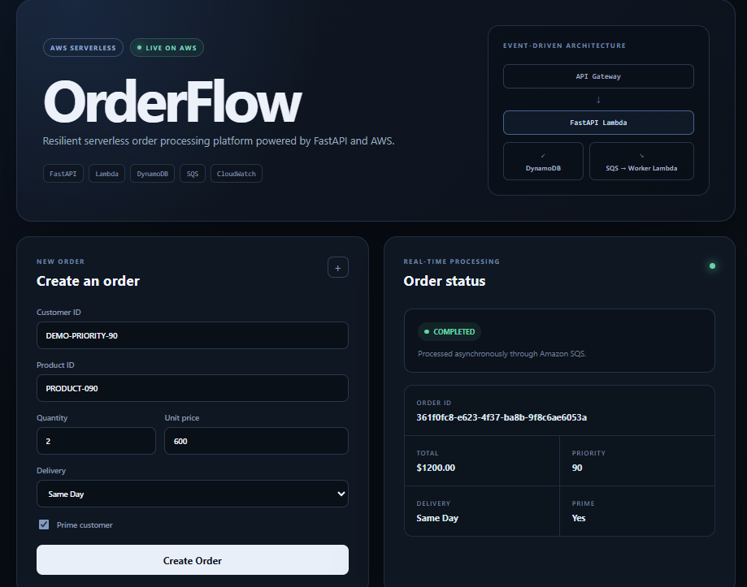
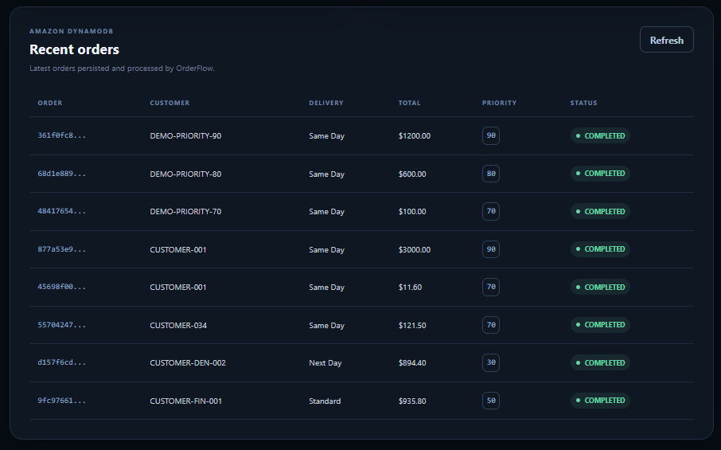

# OrderFlow

### Resilient Serverless Order Processing Platform

[](https://github.com/Denisse8460/order-flow-serverless-platform/actions/workflows/ci.yml)

**OrderFlow** is a cloud-native, event-driven order processing platform built with **React, FastAPI, Python and AWS Serverless services**.

It demonstrates asynchronous processing, distributed idempotency, failure recovery, observability, Infrastructure as Code, automated testing and CI/CD through a production-style architecture.

### Live Demo

**https://main.d3ggtltr5kolu8.amplifyapp.com**

---

## Live Application



The public React dashboard communicates with the deployed AWS backend and allows users to:

- Create orders
- Select delivery type
- Identify Prime customers
- Calculate order priority
- Monitor asynchronous processing
- View completed orders
- Review recently processed orders

The frontend is deployed with **AWS Amplify Hosting** and communicates with the backend through **Amazon API Gateway**.

---

# Architecture



OrderFlow follows an **event-driven serverless architecture**.



### Main request flow

```text
User
 ↓
AWS Amplify
 ↓
React Frontend
 ↓
Amazon API Gateway
 ↓
FastAPI Lambda
 ├──────────────→ DynamoDB
 │
 └──────────────→ Amazon SQS
                       ↓
                  Worker Lambda
                       ↓
                    DynamoDB
```

Failure handling:

```text
Processing failure
      ↓
SQS retry
      ↓
Retries exhausted
      ↓
Dead-Letter Queue
      ↓
CloudWatch Alarm
      ↓
Amazon SNS
      ↓
Email notification
```

---

# Order Processing

When the API receives a new order, it:

1. Validates the request.
2. Creates the order.
3. Persists it in DynamoDB.
4. Calculates its priority score.
5. Publishes an event to Amazon SQS.
6. Returns the created order to the client.

The HTTP request therefore does not need to wait for the complete processing workflow.

A separate **AWS Lambda worker** consumes the SQS event and processes the order asynchronously.

---

## Order Lifecycle

A successfully processed order follows this lifecycle:

```text
PENDING
   ↓
PROCESSING
   ↓
COMPLETED
```

The frontend polls the API after order creation so that users can observe the asynchronous state transition.

---

## Completed Orders

### Priority 70



### Priority 80



### Priority 90



These tests verify that the business rules used by the priority service are being applied correctly.

---

# Order Priority

OrderFlow calculates a numerical priority score using business rules.

| Condition | Score |
|---|---:|
| Prime customer | +40 |
| Same-day delivery | +30 |
| Next-day delivery | +20 |
| Order total ≥ $500 | +10 |
| Order total ≥ $1,000 | +20 |

### Examples

| Scenario | Priority |
|---|---:|
| Prime + Same Day | **70** |
| Prime + Same Day + $600 total | **80** |
| Prime + Same Day + $1,200 total | **90** |



> **Important:** OrderFlow currently uses an Amazon SQS Standard queue.  
> SQS Standard does not guarantee priority-based ordering, so `priority_score` is currently stored as business metadata rather than being used to guarantee execution order.

A future implementation could introduce multiple queues or another scheduling strategy for strict priority processing.

---

# Idempotent Processing

Distributed messaging systems can deliver the same event more than once.

To prevent duplicate processing, OrderFlow implements distributed idempotency using **DynamoDB conditional writes**.

Before processing an order, the worker attempts an atomic transition:

```text
PENDING
   ↓
PROCESSING
```

Only one worker can successfully claim the order.

If another worker receives a duplicate event, the DynamoDB conditional operation prevents it from processing the same order again.

The implementation also supports stale processing leases so abandoned `PROCESSING` orders can eventually be retried.

This provides protection against:

- Duplicate SQS delivery
- Lambda retries
- Concurrent workers
- Partial failures during processing

---

# Resilience and Failure Handling

Amazon SQS automatically retries messages when the worker fails.

After the configured number of attempts, messages are moved to the **Dead-Letter Queue (DLQ)**.

```text
Order event
    ↓
SQS
    ↓
Worker Lambda
    ↓
Failure
    ↓
Retry
    ↓
Failure
    ↓
Retry
    ↓
Dead-Letter Queue
```

The failure path was tested end-to-end using intentionally invalid events.

The test verified:

```text
Invalid event
    ↓
Worker failure
    ↓
SQS retries
    ↓
Dead-Letter Queue
    ↓
CloudWatch ALARM
    ↓
SNS notification
```

After removing the failed message from the DLQ, CloudWatch also returned the alarm to the `OK` state.

---

# Observability

OrderFlow uses **Amazon CloudWatch** for application and infrastructure observability.

The system generates structured JSON logs such as:

```text
order_processing_started
order_processing_completed
order_processing_failed
```

Log context can include:

```text
order_id
message_id
event_type
error_type
error_message
```

CloudWatch alarms monitor:

| Alarm | Purpose |
|---|---|
| DLQ messages | Detect failed messages requiring investigation |
| Oldest queue message | Detect delayed processing |
| API Lambda errors | Detect API execution failures |

Operational alerts are delivered through **Amazon SNS**.

---

# REST API

The backend is implemented with **FastAPI** and exposed through Amazon API Gateway.

| Method | Endpoint | Description |
|---|---|---|
| `GET` | `/health` | Service health check |
| `POST` | `/orders` | Create an order |
| `GET` | `/orders` | Retrieve all orders |
| `GET` | `/orders/{order_id}` | Retrieve an order |
| `PATCH` | `/orders/{order_id}/status` | Update order status |

### Example request

```json
{
  "customer_id": "CUSTOMER-001",
  "items": [
    {
      "product_id": "PRODUCT-001",
      "quantity": 2,
      "unit_price": 300
    }
  ],
  "is_prime": true,
  "delivery_type": "same_day"
}
```

### Example result

```text
Total:      $600
Priority:   80
Status:     COMPLETED
Delivery:   Same Day
Prime:      Yes
```

---

# Technology Stack

| Layer | Technologies |
|---|---|
| Frontend | React, Vite, JavaScript |
| Backend | Python, FastAPI, Mangum |
| API | Amazon API Gateway |
| Compute | AWS Lambda |
| Database | Amazon DynamoDB |
| Messaging | Amazon SQS |
| Failure handling | Dead-Letter Queue |
| Monitoring | Amazon CloudWatch |
| Notifications | Amazon SNS |
| Hosting | AWS Amplify Hosting |
| Infrastructure as Code | AWS SAM, CloudFormation |
| Testing | Pytest, Pytest-Cov |
| Code quality | Ruff |
| Frontend quality | Lint, production build |
| CI/CD | GitHub Actions |
| Version control | Git, GitHub |

---

# Project Structure

```text
order-flow-serverless-platform/
│
├── .github/
│   └── workflows/
│       └── ci.yml
│
├── docs/
│   └── images/
│       ├── orderflow-architecture.png
│       ├── orderflow-dashboard.png
│       ├── orderflow-completed-order-70.png
│       ├── orderflow-completed-order-80.png
│       ├── orderflow-completed-order-90.png
│       └── orderflow-recent-orders.png
│
├── frontend/
│   ├── src/
│   │   ├── App.jsx
│   │   ├── App.css
│   │   ├── index.css
│   │   └── main.jsx
│   ├── package.json
│   └── package-lock.json
│
├── scripts/
│
├── src/
│   ├── api/
│   ├── domain/
│   ├── handlers/
│   ├── observability/
│   ├── repositories/
│   ├── services/
│   └── workers/
│
├── tests/
│
├── pytest.ini
├── requirements.txt
├── requirements-lambda.txt
├── samconfig.toml
├── template.yaml
└── README.md
```

---

# Testing

The backend contains more than 30 automated tests covering areas including:

- Domain models
- Priority calculation
- Order services
- In-memory repository
- DynamoDB repository behavior
- API endpoints
- Worker processing
- Idempotency
- Error handling

Run locally:

```bash
python -m pytest tests -q --cov=src --cov-report=term-missing
```

Code quality:

```bash
ruff check src tests scripts
```

Frontend validation:

```bash
cd frontend

npm run lint
npm run build
```

---

# Continuous Integration

Every push and pull request is validated through **GitHub Actions**.

The pipeline contains three main jobs:

```text
Backend Tests and Code Quality
│
├── Install Python dependencies
├── Ruff
├── Pytest
└── Coverage


Frontend Lint and Build
│
├── npm ci
├── Lint
└── Production build


Validate and Build SAM
│
├── SAM validation
└── Container-based SAM build
```

This helps prevent broken application or infrastructure changes from reaching `main`.

---

# Local Development

## Backend

From the project root:

```bash
pip install -r requirements.txt
pip install -r requirements-lambda.txt
```

Run the test suite:

```bash
python -m pytest tests -q
```

---

## Frontend

```bash
cd frontend

npm install
npm run dev
```

Create:

```text
frontend/.env.local
```

with:

```text
VITE_API_URL=https://your-api-id.execute-api.us-east-1.amazonaws.com
```

Then open:

```text
http://localhost:5173
```

---

# AWS Deployment

Infrastructure is deployed using **AWS SAM**.

Validate the SAM template:

```bash
sam validate --lint --template-file template.yaml
```

Build:

```bash
sam build --template-file template.yaml --use-container
```

Deploy:

```bash
sam deploy
```

The AWS backend currently uses existing DynamoDB and SQS resources supplied to the SAM stack through parameters.

The React application is deployed separately through **AWS Amplify Hosting**.

---

# CORS Configuration

The FastAPI application supports configurable allowed origins through:

```text
ORDERFLOW_ALLOWED_ORIGINS
```

The SAM template provides allowed origins for:

```text
Local React development
+
Public AWS Amplify frontend
```

This allows the deployed frontend to communicate with the API while avoiding an unrestricted browser CORS configuration.

---

# Engineering Decisions

### Asynchronous processing

Order creation and order processing are intentionally separated.

The API handles:

```text
Validation
Persistence
Event publication
```

while the worker handles:

```text
Background processing
State transitions
Failure handling
```

This reduces coupling between HTTP traffic and background workloads.

### Repository abstraction

Business logic interacts with repository abstractions instead of directly depending on DynamoDB.

This makes the application easier to test and keeps infrastructure concerns separated from domain logic.

### Queue abstraction

The service layer does not need to know whether events are handled by an in-memory queue or Amazon SQS.

### DynamoDB idempotency

Conditional writes provide atomic distributed coordination without requiring a separate locking service.

### Infrastructure as Code

AWS infrastructure configuration is version controlled through AWS SAM and validated by CI.

### Observability

Structured logs, metrics, alarms and notifications make failure behavior visible instead of silently ignoring errors.

---

# Current Limitations

OrderFlow is a portfolio project intended to demonstrate cloud and software engineering concepts rather than operate as a commercial production platform.

Current limitations include:

- No user authentication
- No authorization layer
- No payment processing
- No strict priority scheduling
- No multi-region deployment
- Development-oriented AWS resource naming
- Public demo intended for portfolio traffic

A production implementation would additionally require controls such as authentication, authorization, rate limiting, WAF policies, environment separation, cost controls, secret management and expanded monitoring.

---

# What This Project Demonstrates

OrderFlow demonstrates practical experience with:

```text
✓ Python
✓ FastAPI
✓ REST API development
✓ React
✓ JavaScript
✓ Object-oriented design
✓ Modular architecture
✓ Event-driven architecture
✓ AWS Lambda
✓ Amazon API Gateway
✓ Amazon DynamoDB
✓ Amazon SQS
✓ Dead-Letter Queues
✓ Distributed idempotency
✓ CloudWatch logs and alarms
✓ SNS notifications
✓ Infrastructure as Code
✓ AWS SAM
✓ CloudFormation
✓ Automated testing
✓ CI/CD
✓ GitHub Actions
✓ AWS Amplify Hosting
✓ Git branching and pull requests
✓ Failure testing and debugging
```

---

# Author

**Denisse Reyes Galicia**

Computer Engineering graduate interested in:

**Software Engineering · Cloud Engineering · Data Engineering · Artificial Intelligence**

GitHub: [Denisse8460](https://github.com/Denisse8460)

---